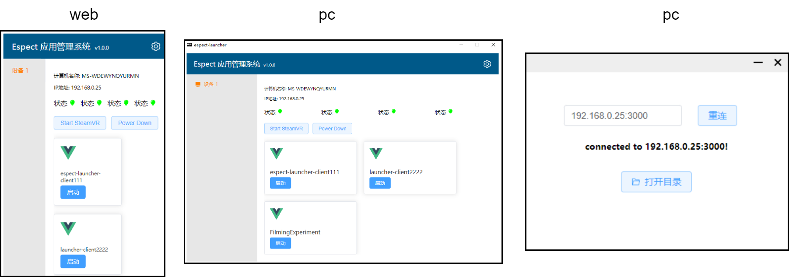
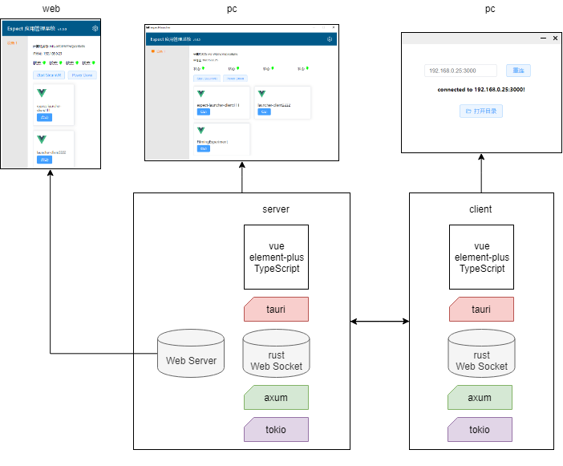

# Vue 3 + TypeScript + Vite

This template should help get you started developing with Vue 3 and TypeScript in Vite. The template uses Vue 3 `<script setup>` SFCs, check out the [script setup docs](https://v3.vuejs.org/api/sfc-script-setup.html#sfc-script-setup) to learn more.

## Recommended IDE Setup

- [VS Code](https://code.visualstudio.com/) + [Volar](https://marketplace.visualstudio.com/items?itemName=Vue.volar)

## Type Support For `.vue` Imports in TS

Since TypeScript cannot handle type information for `.vue` imports, they are shimmed to be a generic Vue component type by default. In most cases this is fine if you don't really care about component prop types outside of templates. However, if you wish to get actual prop types in `.vue` imports (for example to get props validation when using manual `h(...)` calls), you can enable Volar's Take Over mode by following these steps:

1. Run `Extensions: Show Built-in Extensions` from VS Code's command palette, look for `TypeScript and JavaScript Language Features`, then right click and select `Disable (Workspace)`. By default, Take Over mode will enable itself if the default TypeScript extension is disabled.
2. Reload the VS Code window by running `Developer: Reload Window` from the command palette.

You can learn more about Take Over mode [here](https://github.com/johnsoncodehk/volar/discussions/471).


https://gitee.com/shengxp_760/vue-element-faster

https://github.com/GeekQiaQia/vue3.0-template-admin

stylus
npm install stylus stylus-loader style-loader --save-dev


axum 处理静态资源

https://www.cnblogs.com/yjmyzz/p/axum_tutorial_5_static_file.html


Preview1




Preview2




项目环境:

node 16.15.1 (建议用 nvm 管理 nodejs 版本)
rustc 1.70.0 (90c541806 2023-05-31)

项目初始化:
项目由两个部分组成, 服务端 server, 客户端 pc-client
服务端由一个 tcp server 和 一个 基于 axum 的web server, 以及一个 web socket server 组成
tcp server, 用于监听来自客户端的连接
web server, 用于移动设备通过web浏览器, 然后通过websocket和server 通信 (仅限局域网)

web server 的前端页面部分由 web-frontend 提供 (一个 vue3 + ts 的前端项目)
web 客户端通过 websocket 和 server 通信

一, 编译 web-frontend

``` bash
cd web-frontend
npm run build
```
会在项目目录下生成一个 dist 文件夹,提供 web server 所需的静态文件

二, 编译服务端
``` bash
cd ..
npm run tauri build
```

debug 模式启动
``` bash
npm run tauri dev
```

三, 编译 pc-client
``` bash
cd pc-client
npm run tauri build
```

debug 模式启动
``` bash
npm run tauri dev
```